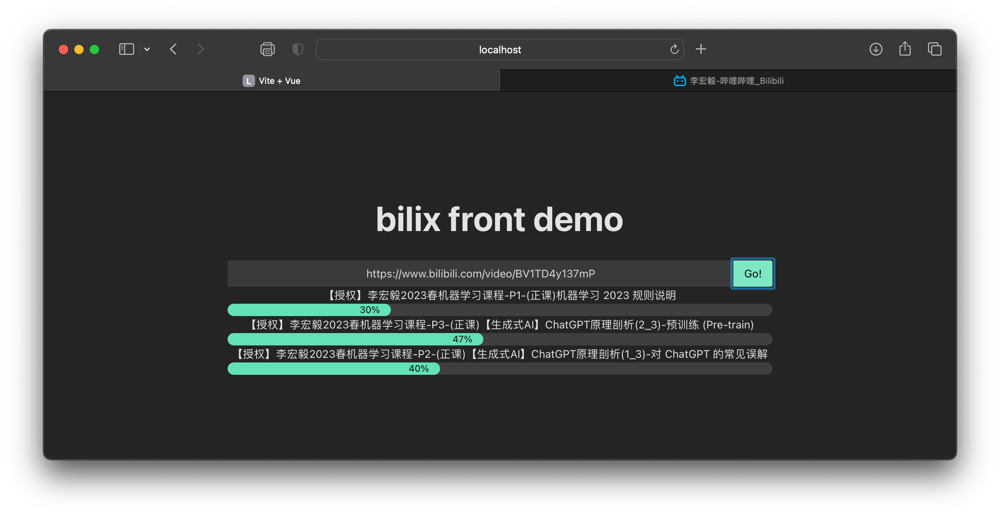

# bilix-front-demo

A Web UI (demo) managing bilix download service.


## start bilix service

* install serve requirements

```shell
pip install -r serve/requirements.txt
```

* start bilix server

```shell
uvicorn serve:app
```

## front dev

* install requirements

```shell
npm i
```

* start dev server

```shell
vite
```